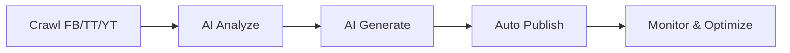

# Kolia Competitor Intelligence Platform

> **Hệ thống tự động:** Crawl dữ liệu đối thủ → AI phân tích → Sinh nội dung → Đăng tải → Đo lường → Tối ưu

## 🚀 Kiến trúc



## 📚 Tài liệu chi tiết

Xem trong thư mục [`docs/`](docs/):

| File | Mô tả |
|---|---|
| [`docs/README.md`](docs/README.md) | Tổng quan kiến trúc & luồng tự động hoá |
| [`docs/01-setup.md`](docs/01-setup.md) | Hướng dẫn cài đặt & cấu hình |
| [`docs/02-crawl-pipeline.md`](docs/02-crawl-pipeline.md) | Crawl Facebook, TikTok, YouTube |
| [`docs/03-ai-content-generation.md`](docs/03-ai-content-generation.md) | AI sinh kịch bản YouTube/TikTok/Facebook |
| [`docs/04-publish-automation.md`](docs/04-publish-automation.md) | Đăng bài, lịch, webhook, alerts |
| [`docs/05-enterprise-features.md`](docs/05-enterprise-features.md) | Team, API, Audit & Security |
| [`docs/06-workflow-quickstart.md`](docs/06-workflow-quickstart.md) | Quickstart từ A-Z |

## 🏁 Quick start

```bash
npm install
npx playwright install chromium
npx prisma@6.18.0 db push
npm run seed
npm run dev
```

Website: **http://localhost:3000**

## 🔗 Navigation

```
/                  Dashboard tổng quan
/youtube           YouTube Tracker
/tiktok            TikTok Tracker
/facebook          Facebook Tracker
/content-gap       Khoảng trống nội dung
/content           Thư viện nội dung AI
/calendar          Lịch đăng nội dung
/recommendations   Đề xuất chiến lược
/viral-patterns    Viral Patterns
/ab-test           A/B Test Simulator
/brand-voice       Brand Voice
/query             Hỏi đáp dữ liệu AI
/reports           Tạo báo cáo phân tích
/team              Team & API Keys
/integrations      Tích hợp & Webhook
/settings          Cấu hình & Bảo mật
```

```bash
node .tools/npm/bin/npm-cli.js install
node .tools/npm/bin/npm-cli.js run seed
node .tools/npm/bin/npm-cli.js run dev
```

## Tự chạy localhost khi đăng nhập Windows

Đăng ký Windows Scheduled Task để tự bật server local:

```powershell
powershell -ExecutionPolicy Bypass -File scripts/register-localhost-task.ps1
```

Nếu Windows chặn Scheduled Task vì thiếu quyền, dùng Startup folder launcher:

```powershell
powershell -ExecutionPolicy Bypass -File scripts/install-startup-launcher.ps1
```

Sau khi đăng ký, Windows sẽ tự chạy `http://localhost:3000/openai-test` khi user đăng nhập. Có thể chạy tay bất cứ lúc nào:

```powershell
powershell -ExecutionPolicy Bypass -File scripts/start-localhost.ps1
```

## Chức năng chính

- Dashboard tổng quan bằng tiếng Việt.
- Tracker riêng cho YouTube, TikTok và Facebook.
- Trang `Kiểm tra OpenAI API` dùng OpenAI SDK và Responses API qua route server-side.
- Nút `Sync Data` gọi `POST /api/sync`, thêm dữ liệu mô phỏng mới và refresh dashboard.
- SQLite local với Prisma, seed sẵn danh sách đối thủ theo yêu cầu.
- Rule-based classifier tại `lib/classifier.ts` cho trụ cột nội dung, nhóm CTA/ưu đãi, sắc thái truyền thông, kiểu mở đầu, định dạng triển khai và chủ đề chính.
- Adapter boundary:
  - `lib/adapters/youtubeAdapter.ts`
  - `lib/adapters/tiktokAdapter.ts`
  - `lib/adapters/facebookAdapter.ts`
- Settings cho API key/token placeholder, không hardcode token vào frontend.
- Tạo báo cáo phân tích và export CSV dữ liệu thô, JSON, Markdown, Google Docs.

## Xuất Google Docs

Để tạo Google Docs thật từ bản local:

1. Tạo Google Cloud project.
2. Enable Google Docs API và Google Drive API.
3. Tạo OAuth Client dạng Web application.
4. Thêm redirect URI:

```bash
http://localhost:3000/api/google/oauth/callback
```

5. Cấu hình env:

```bash
GOOGLE_CLIENT_ID="..."
GOOGLE_CLIENT_SECRET="..."
GOOGLE_REDIRECT_URI="http://localhost:3000/api/google/oauth/callback"
```

6. Vào trang `Tạo báo cáo phân tích`, chọn `Google Docs report`, bấm `Kết nối Google Drive`, cấp quyền một lần rồi xuất báo cáo.

Google Docs export dùng OAuth cá nhân, tài liệu được tạo trong Google Drive của tài khoản đã cấp quyền. Scope mặc định:

```bash
https://www.googleapis.com/auth/documents
https://www.googleapis.com/auth/drive.file
```

## API routes

- `GET /api/openai/test`
- `POST /api/openai/test`
- `GET /api/competitors`
- `POST /api/competitors`
- `PUT /api/competitors/:id`
- `DELETE /api/competitors/:id`
- `POST /api/sync`
- `GET /api/posts`
- `GET /api/analytics/overview`
- `GET /api/analytics/platform/:platform`
- `GET /api/reports/generate`
- `GET /api/export/csv`
- `GET /api/export/json`
- `GET /api/export/markdown`

## Lưu ý nội dung

Dashboard phục vụ mục đích nghiên cứu marketing, không phải khuyến nghị đầu tư cá nhân. Dữ liệu mô phỏng được thiết kế giống dữ liệu marketing thực tế để demo automation khi chưa có API key/provider hợp lệ.

## OpenAI Responses API

Thêm key vào `.env`:

```bash
OPENAI_API_KEY="sk-..."
OPENAI_MODEL="gpt-5.5"
```

Sau đó restart dev server và mở:

```bash
http://localhost:3000/openai-test
```

API key chỉ được đọc ở server trong `POST /api/openai/test`, không được gửi xuống frontend.
