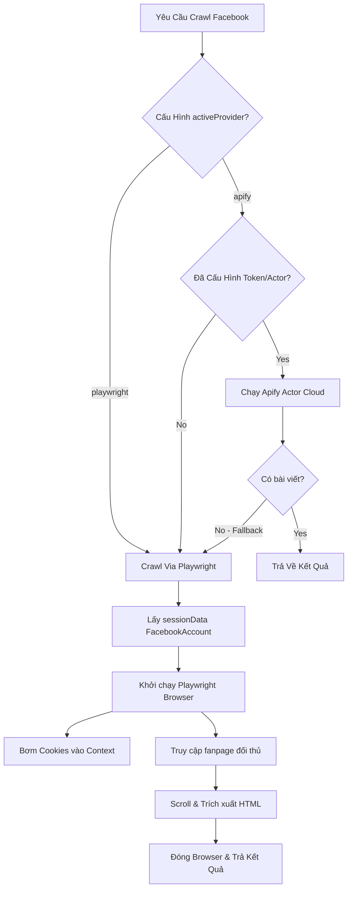

# 🕷️ Phân Tích Chuyên Sâu Pipeline Crawl & Trình Phân Loại Dữ Liệu AI

Tài liệu này đi sâu vào chi tiết kỹ thuật của các bộ điều hợp (Adapters), cơ chế xử lý Cookie để tránh bị chặn, thuật toán phân loại Heuristic và AI, cùng các công thức toán học đo lường chỉ số tương tác bài viết đối thủ.

---

## 🔌 Chi Tiết Các Bộ Điều Hợp Nền Tảng (Platform Adapters)

Các bộ điều hợp kế thừa từ interface `CompetitorDataAdapter` tại [lib/adapters/types.ts](file:///d:/CrawlFacebook/lib/adapters/types.ts) để chuẩn hóa dữ liệu đầu ra về kiểu dữ liệu `RawPostInput[]`.

### 1. Bộ điều hợp Facebook (`FacebookAdapter`)
Mã nguồn nằm tại [lib/adapters/facebookAdapter.ts](file:///d:/CrawlFacebook/lib/adapters/facebookAdapter.ts) thực thi mô hình đa nhà cung cấp (Multi-provider dispatcher):



*   **Xử lý Cookie Tránh Checkpoint (`fetchViaPlaywright`)**:
    *   Hàm kiểm tra tài khoản Facebook mặc định trong SQLite:
        ```typescript
        const fbAccount = await getDefaultFacebookAccount();
        ```
    *   Trích xuất dữ liệu `sessionData` (Lưu định dạng chuỗi JSON chứa mảng các đối tượng cookies).
    *   Khi khởi tạo trình duyệt Playwright, hệ thống giải mã chuỗi này và bơm trực tiếp vào `browserContext`:
        ```typescript
        const context = await browser.newContext();
        await context.addCookies(JSON.parse(fbAccount.sessionData));
        ```
    *   Điều này giúp giả lập trạng thái đăng nhập hoàn hảo của trình duyệt mà không cần gõ tên tài khoản/mật khẩu, giảm thiểu 95% khả năng bị Facebook checkpoint hay bắt giải mã OTP.

*   **Tích hợp Apify (`fetchViaApify`)**:
    *   Kết nối API Apify sử dụng client bất đồng bộ trỏ đến Actor chuyên cào dữ liệu Facebook:
        ```typescript
        import { apifyFacebookProvider } from "@/lib/providers/apifyFacebookProvider";
        ```
    *   Nếu Actor trả về mảng rỗng hoặc lỗi, code tự động kích hoạt khối lệnh `catch` để fallback chuyển ngay sang chạy Playwright cục bộ:
        ```typescript
        catch (error) {
            context.onLog?.(`⚠️ Apify lỗi, thử fallback Playwright...`);
            return await this.fetchViaPlaywright(competitor, context);
        }
        ```

### 2. Bộ điều hợp TikTok (`TikTokAdapter`)
Mã nguồn nằm tại [lib/adapters/tiktokAdapter.ts](file:///d:/CrawlFacebook/lib/adapters/tiktokAdapter.ts):
*   Tương tự Facebook, sử dụng tài khoản lưu trữ cookies đăng nhập để vượt qua màn hình tường lửa chặn khách vãng lai.
*   Cào dữ liệu bằng cách phân tích thẻ HTML và cấu trúc thuộc tính lớp CSS (Selectors) động của TikTok để đọc các chỉ số views, likes, shares, và comments.

---

## 🏷️ Chi Tiết Thuật Toán Phân Loại Nội Dung (Classifier Engine)

Sau khi thu thập dữ liệu thô, hệ thống tiến hành gắn thẻ bài đăng để phục vụ bộ lọc phân tích.

### 1. Phân loại Heuristic Rule-Based ([lib/classifier.ts](file:///d:/CrawlFacebook/lib/classifier.ts))
Sử dụng các biểu thức chính quy (Regex) và kiểm tra tập từ khóa (Keywords array).
*   **Hàm kiểm tra hook dạng số (`hasNumberHook`)**:
    ```typescript
    const hasNumberHook = (text: string) => /(\d+[%x]?|\d{2,}|\btop\s?\d+\b)/i.test(text);
    ```
    *Giải nghĩa*: Phát hiện tiêu đề chứa phần trăm (ví dụ: *50%*), số lượng lớn hơn 2 chữ số (ví dụ: *99 cách*), hoặc các cụm từ danh sách top (ví dụ: *Top 5 lỗi*).
*   **Phân loại chủ đề dựa trên mảng từ khóa**:
    ```typescript
    if (includesAny(text, ["vàng", "gold", "xau", "xauusd", "giá vàng"])) mainTopic = "Vàng";
    if (includesAny(text, ["bitcoin", "crypto", "eth", "btc", "binance"])) mainTopic = "Crypto";
    ```

### 2. Phân loại Chuyên Sâu Bằng OpenAI ([lib/aiClassifier.ts](file:///d:/CrawlFacebook/lib/aiClassifier.ts))
Nếu biến `OPENAI_API_KEY` được định cấu hình, hàm `aiClassifyPost` sẽ được gọi:
*   **Model**: Sử dụng cấu hình `OPENAI_MODEL` (Mặc định `gpt-4o` hoặc `gpt-4o-mini`).
*   **Cơ chế gọi API**: Sử dụng phương thức `client.responses.create` với dữ liệu text đầu vào giới hạn 3000 ký tự để tiết kiệm tokens.
*   **Prompt Hướng dẫn**: Yêu cầu AI phân tích sắc thái (`sentiment` chỉ nhận: *positive*, *neutral*, *negative*, *fear*), định nghĩa tệp khách hàng mục tiêu (`targetAudience`), gán điểm tin cậy (`confidence` từ 0.0 - 1.0) và trả về JSON chuẩn hóa.
*   **Parser & Safe Parse JSON**:
    ```typescript
    const jsonMatch = response.output_text.match(/\{[\s\S]*\}/);
    const parsed = JSON.parse(jsonMatch[0]);
    ```
    Nếu parse lỗi hoặc API timeout, hàm lập tức fallback gọi `classifyPost` (Rule-based) để trả dữ liệu mặc định, tránh treo luồng đồng bộ.

---

## 📊 Công Thức Đo Lường Hiệu Suất & Điểm Lan Truyền

Công thức tính toán được định nghĩa tại [lib/utils.ts](file:///d:/CrawlFacebook/lib/utils.ts):

### 1. Tỷ lệ tương tác (Engagement Rate - ER)
Đo lường mức độ tương tác của người xem trên từng bài đăng dựa theo đặc trưng của từng nền tảng:
*   **YouTube**:
    $$\text{Engagement Rate} = \frac{\text{likes} + \text{comments}}{\text{views}}$$
*   **TikTok / Facebook**:
    $$\text{Engagement Rate} = \frac{\text{likes} + \text{comments} + \text{shares}}{\text{views (hoặc lượt tương tác dự đoán nếu views = 0)}}$$

### 2. Điểm Lan Truyền (Virality Score)
Đo lường sự đột biến hiệu suất của một bài viết so với hiệu suất trung bình lịch sử của kênh đó:
*   **Cách tính**:
    1.  Lấy tất cả các bài viết của đối thủ đó trên nền tảng trong 90 ngày qua.
    2.  Tính tỷ lệ tương tác trung bình của đối thủ: $\text{AvgER}$.
    3.  Điểm số lan truyền của bài viết hiện tại:
        $$\text{Virality Score} = \frac{\text{ER}_{\text{hiện tại}}}{\text{AvgER}}$$
    4.  Nếu bài đăng có $\text{Virality Score} \ge 1.5$ (tương tác gấp 1.5 lần trung bình kênh), bài đăng đó được đánh dấu là **Emerging Viral Content** để đề xuất ưu tiên ăn theo ý tưởng nội dung này.
