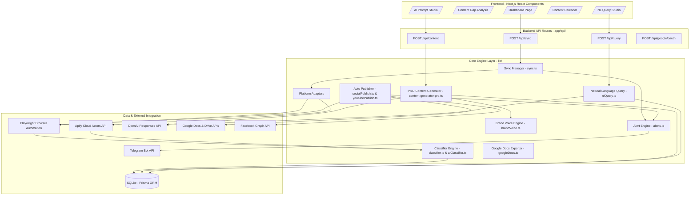

# 📚 Kiến Trúc Tổng Quan & Bản Đồ Thành Phần Hệ Thống

Tài liệu này cung cấp cái nhìn chi tiết và chuyên sâu nhất về sơ đồ kiến trúc, cấu trúc thư mục mã nguồn chi tiết, và lược đồ cơ sở dữ liệu (Database Schema) cùng danh sách các API endpoints trong dự án **Kolia Competitor Intelligence Platform**.

---

## 🏗️ Sơ Đồ Kiến Trúc Hệ Thống Chi Tiết

Hệ thống hoạt động dưới dạng một ứng dụng Next.js Monolith hoàn chỉnh, tích hợp cả Frontend, Backend API và các tác vụ ngầm (Background tasks):



---

## 📂 Chi Tiết Cấu Trúc Mã Nguồn (File-Level Directory Map)

```bash
d:\CrawlFacebook\
├── app/                              # Next.js App Router (UI & Routing)
│   ├── page.tsx                      # Dashboard tổng quan hiển thị KPIs tiếng Việt
│   ├── layout.tsx                    # Bố cục giao diện chung, sidebar navigation
│   ├── globals.css                   # Định nghĩa TailwindCSS & biến CSS variables
│   ├── content/                      # Thư viện sản xuất & phê duyệt nội dung
│   │   └── page.tsx                  # UI Studio điều phối tạo content
│   ├── content-gap/                  # Giao diện bản đồ nhiệt (Heatmap) khoảng trống thị trường
│   ├── query/                        # Trang hỏi đáp ngôn ngữ tự nhiên thông minh
│   ├── calendar/                     # Quản lý kịch bản dạng kéo thả / lịch đăng bài
│   ├── ab-test/                      # Mô phỏng thử nghiệm hiệu năng Title/Thumbnail
│   ├── brand-voice/                  # Cấu hình phong cách thương hiệu (Kolia default)
│   ├── settings/                     # Giao diện thiết lập API keys, Token, Webhooks
│   └── api/                          # Backend Serverless Functions
│       ├── sync/                     # POST: Kích hoạt đồng bộ cào dữ liệu ngầm
│       ├── content/                  # POST: Gọi Content Generator Engine
│       │   └── generate-pro/         # POST: API trigger quy trình AI 4 bước
│       ├── query/                    # POST: Biên dịch ngôn ngữ tự nhiên sang SQL
│       ├── google/                   # OAuth 2.0 Client Callback handlers
│       └── webhooks/                 # API CRUD & trigger Webhook sự kiện
├── components/                       # UI Components dùng chung
│   ├── ContentPromptStudio.tsx       # Thành phần trung tâm điều khiển prompt & hiển thị 4 bước AI
│   ├── GlobalSyncStatus.tsx          # Thanh tiến trình & log realtime SSE cho Sync
│   └── ui/                           # Radix UI primitives (Button, Dialog, Toast...)
├── lib/                              # Logic cốt lõi (Core Business Engine)
│   ├── sync.ts                       # Đồng bộ hóa dữ liệu đối thủ (Stream SSE & Background)
│   ├── classifier.ts                 # Phân loại heuristics rule-based (Regex/Keywords)
│   ├── aiClassifier.ts               # Phân loại chuyên sâu bằng OpenAI Responses API
│   ├── content-generator-pro.ts      # Toàn soạn AI PRO Multi-Step (4 bước)
│   ├── brandVoice.ts                 # Trích xuất, huấn luyện, học văn phong Brand Voice
│   ├── nlQuery.ts                    # Biên dịch ngôn ngữ tự nhiên -> SQLite Query
│   ├── googleDocs.ts                 # Kết nối, xuất bản nội dung lên Google Docs
│   ├── socialPublish.ts              # Facebook API & TikTok Playwright auto-publish
│   ├── youtubePublish.ts             # YouTube Data API upload & schedule
│   ├── alerts.ts                     # Dispatcher gửi cảnh báo Slack, Telegram, Email, Webhooks
│   ├── prisma.ts                     # Singleton instance kết nối Prisma Client
│   └── types.ts                      # Tập hợp các TypeScript Interfaces toàn hệ thống
├── prisma/                           # Cơ sở dữ liệu SQLite
│   ├── schema.prisma                 # Lược đồ quan hệ chi tiết các bảng
│   └── seed.ts                       # Chèn dữ liệu khởi tạo đối thủ mẫu
└── scripts/                          # Script PowerShell cài đặt & quản lý hệ thống
```

---

## 🗄️ Phân Tích Chi Tiết Lược Đồ Cơ Sở Dữ Liệu (Prisma Models)

Hệ thống lưu trữ cấu trúc dữ liệu chặt chẽ trong SQLite, tối ưu hóa qua các chỉ mục (Indexes) để truy vấn nhanh:

### 1. Model `Competitor` (Đối thủ cạnh tranh)
*   **Mục đích**: Lưu trữ thông tin tài khoản/kênh của đối thủ.
*   **Trường dữ liệu**:
    *   `id` (String - CUID, Khóa chính).
    *   `name` (String): Tên đối thủ.
    *   `platform` (String): Nền tảng (`youtube`, `tiktok`, `facebook`).
    *   `channelUrl` (String): URL kênh/trang đối thủ.
    *   `avatarUrl` (String, nullable): Đường dẫn ảnh đại diện.
    *   `category` (String): Phân khúc sản phẩm.
    *   `segmentation` (String, nullable): Phân nhóm thị trường.
*   **Chỉ mục (Indexes)**: `@@index([platform])`, `@@index([source])`.
*   **Quan hệ**: Một `Competitor` có quan hệ 1-Nhiều với model `Post` (Cascade delete).

### 2. Model `Post` (Bài đăng thu thập từ đối thủ)
*   **Mục đích**: Lưu trữ dữ liệu bài viết thô và dữ liệu phân loại AI của đối thủ.
*   **Trường dữ liệu**:
    *   `id` (String - CUID, Khóa chính).
    *   `competitorId` (String, Khóa ngoại liên kết bảng `Competitor`).
    *   `platform` (String).
    *   `postUrl` (String): Liên kết bài đăng gốc.
    *   `title` (String), `caption` (String).
    *   `publishedAt` (DateTime).
    *   `views`, `likes`, `comments`, `shares` (Int, default 0).
    *   `engagementRate` (Float, default 0): Tỷ lệ tương tác.
    *   `viralityScore` (Float, default 0): Chỉ số lan truyền.
    *   *AI Classified Fields*:
        *   `format` (String): Định dạng bài viết (reel, short_video, long_video, text_post, carousel).
        *   `contentPillar` (String): Trụ cột nội dung.
        *   `promotionType` (String): Loại chuyển đổi/CTA.
        *   `toneOfVoice` (String): Sắc thái bài viết.
        *   `hookType` (String): Loại giật tít mở đầu.
        *   `mainTopic` (String): Chủ đề chính.
*   **Chỉ mục**: `@@index([platform])`, `@@index([contentPillar])`, `@@index([publishedAt])`.

### 3. Model `GeneratedContent` (Nội dung do AI tạo ra)
*   **Mục đích**: Lưu giữ kịch bản, bài viết do quy trình PRO tạo ra cùng lịch trình xuất bản.
*   **Trường dữ liệu**:
    *   `id` (String - CUID, Khóa chính).
    *   `platform` (String), `contentType` (String).
    *   `title` (String), `script` (String): Tiêu đề và nội dung kịch bản/bài viết hoàn chỉnh.
    *   `thumbnailIdea` (String, nullable), `cta` (String, nullable).
    *   `toneOfVoice` (String), `mainTopic` (String).
    *   `status` (String, default "draft"): Trạng thái (`draft`, `approved`, `scheduled`, `published`, `archived`).
    *   `scheduledAt` (DateTime, nullable): Lịch hẹn đăng.
    *   `publishAt` (DateTime, nullable): Thời gian đăng thực tế.
    *   `publishedUrl` (String, nullable): Đường dẫn bài đăng sau khi xuất bản thành công.
    *   `predictedViews` (Int, nullable), `predictedEngagement` (Float, nullable).
    *   `sourceGap` (String, nullable): Danh sách IDs khoảng trống nội dung dạng JSON.
    *   `sourcePosts` (String, nullable): Danh sách IDs bài viết tham khảo dạng JSON.

### 4. Model `FacebookAccount` & `TikTokAccount`
*   **Mục đích**: Lưu thông tin cookie, session đăng nhập để Playwright crawl không bị xác thực lại.
*   **Trường dữ liệu**:
    *   `sessionData` (String): JSON chuỗi mã hóa cookies / localStorage.
    *   `isDefault` (Boolean), `isValid` (Boolean).

### 5. Model `Webhook`, `Alert`, `AuditLog`
*   **Mục đích**: Lưu thông tin tích hợp thông báo và vết hệ thống.
*   **Trường dữ liệu**:
    *   `AuditLog`: `action` (Ví dụ: `content.publish`), `entity` (Ví dụ: `content`), `entityId`, `metadata` (JSON bối cảnh).

---

## 🌐 Danh Sách API Endpoints Chi Tiết

| HTTP Method | API Path | Tệp Handler | Chức năng chi tiết |
| :--- | :--- | :--- | :--- |
| `POST` | `/api/sync` | `app/api/sync/route.ts` | Kích hoạt cào dữ liệu đối thủ. Trả về `jobId` ngay lập tức để chạy ngầm (Background job). |
| `GET` | `/api/sync/status?jobId=...` | `app/api/sync/status/route.ts` | Trả về trạng thái, phần trăm tiến độ (`percent`) và mảng lịch sử log (`logs`) của tiến trình cào dữ liệu. |
| `POST` | `/api/content/generate-pro` | `app/api/content/generate-pro/route.ts` | Kích hoạt động cơ AI 4 bước. Hỗ trợ Server-Sent Events (SSE) để truyền trạng thái từng bước về UI. |
| `POST` | `/api/query` | `app/api/query/route.ts` | Tiếp nhận câu hỏi tiếng Việt, chuyển sang SQL, thực thi và trả về phân tích ngôn ngữ tự nhiên từ DB. |
| `GET` | `/api/posts` | `app/api/posts/route.ts` | Lấy danh sách bài viết đối thủ, lọc nâng cao theo `platform`, `mainTopic`, `contentPillar`, sắp xếp theo `engagementRate` hoặc `viralityScore`. |
| `POST` | `/api/social/publish` | `app/api/social/publish/route.ts` | Đăng bài viết lên Fanpage Facebook (Graph API) hoặc TikTok (Playwright Automation). |
| `GET` | `/api/reports/generate` | `app/api/reports/generate/route.ts` | Tạo tài liệu phân tích tổng hợp. Định dạng xuất bản: Markdown, JSON, CSV hoặc Google Docs. |
